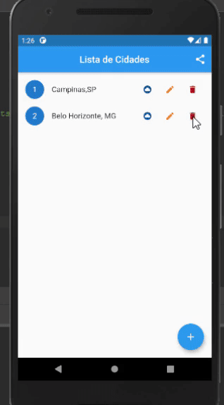

# flutter_app_web

Este app se utiliza de uma API web para verificar o clima de determinada região.
Quando o usuário insere uma cidade, é possivel modificar a mesma, deletar, ou ver o clima no dia atual
